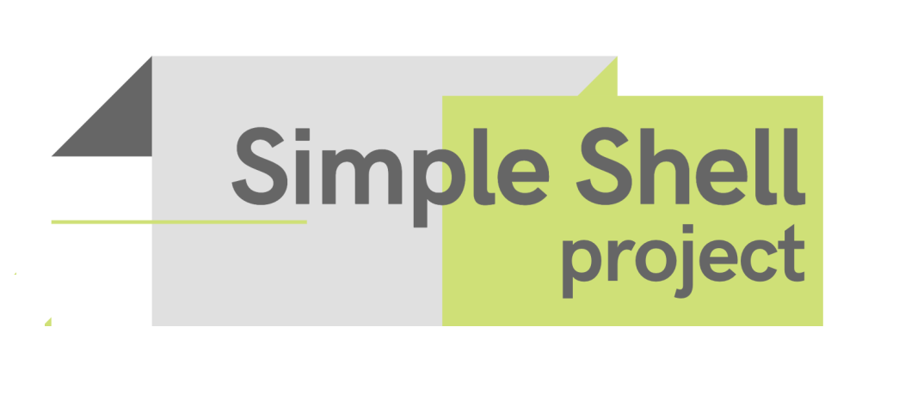
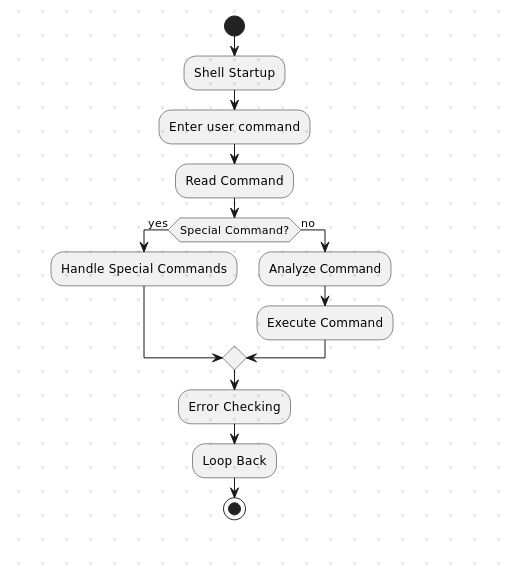

# SIMPLE SHELL


## Synopsis

The Simple Shell is a tool that helps users give commands to the computer. It takes the commands you type in, works with them, and does what you asked. It's like a basic version of the Unix shell, made to handle simple tasks. The Simple Shell is made with the C programming language, making it easy to use for running commands on your computer.

## Requirements

* Compilation: Ubuntu 22.04.4 LTS using gcc, using the options -Wall -Werror -Wextra -pedantic -std=gnu89
* Your code should use the Betty style. It will be checked using betty-style.pl and betty-doc.pl
* Your shell should not have any memory leaks
* No more than 5 functions per file
* All your header files should be include guarded


## ➤ If you want to use our Simple Shell:

* Install

To use our simple shell you can clone this repository:<br>

```git clone git@github.com:khadmalek/holbertonschool-simple_shell.git```

* Compilation

```gcc -Wall -Werror -Wextra -pedantic -std=gnu89 *.c -o hsh```
* Execut

To run our Simple Shell :<br>

  ```./hsh```


### ➤ Librairies:

| `#include <stdio.h>` |
`#include <stdlib.h>` |
-`#include <string.h>`|
`#include <unistd.h>`|`#include <sys/types.h>`|`#include <sys/wait.h>`|`#include <sys/stat.h>`|


## Man page 

* Read the man using :<br>

  ```man ./man_1_simple_shell```


## Diagram UML



## File structure

| File | Description 
| -------- | -------- |
| main.h   |Header file with function declarations and includes needed for the shell program.    |
| getpath.c | This function gets the path to the executable files from the environment variable PATH. It opens the PATH environment variable and reads the value into a buffer. It then splits the buffer into individual paths, storing them in an array. |
| command_executor  | The provided C code defines a function execute_command that executes a given command. It tokenizes the command, determines the path, and uses execve to execute the command. The function handles errors and returns 1 on success. | 
| read_command.c | This function reads a line of input from the user. It first opens the standard input stream (stdin) and reads a character from it. If the character is a newline character, it stops reading and returns the line of input. If the character is not a newline character, it stores it in a buffer and then reads the next character. | 
| string_tokenizer.c | This function takes a string as input and splits it into individual tokens. It first allocates memory for an array of tokens. It then iterates over the string, splitting it into tokens using the whitespace character as a delimiter. Each token is stored in the array of tokens. Finally, it returns the array of tokens.|
| simple_shell.c    | This is the main function of the shell program. It calls the getpath function to get the path to the executable files. It then enters a loop that repeatedly reads a line of input from the user, splits it into tokens, and executes the command. If the command is the exit command, the loop terminates.|
| AUTHORS | Contains authors' names and github links |
| README.md | File containing information about the project.|


----------

## Testing :

Shell should work like this in interactive mode:
```
$ ./hsh
($) /bin/ls
hsh main.c shell.c
($)
($) exit
$
```
But also in non-interactive mode:
```
$ echo "/bin/ls" | ./hsh
hsh main.c shell.c test_ls_2
$
$ cat test_ls_2
/bin/ls
/bin/ls
$
$ cat test_ls_2 | ./hsh
hsh main.c shell.c test_ls_2
hsh main.c shell.c test_ls_2
$
```

## Authors
- Guillaume SELLIER [Github](https://github.com/Guillom8769)
- Khadija ABDELMALEK [Github](https://github.com/khadmalek)
----------